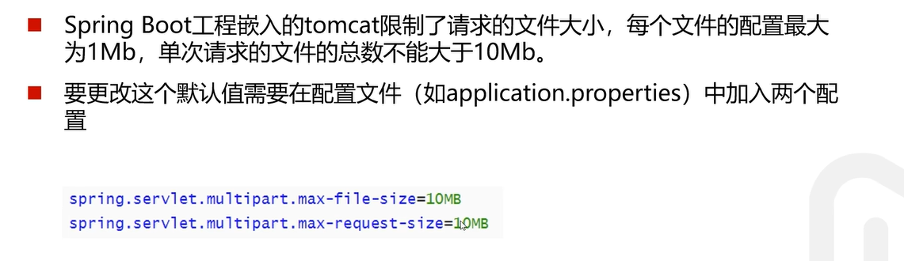
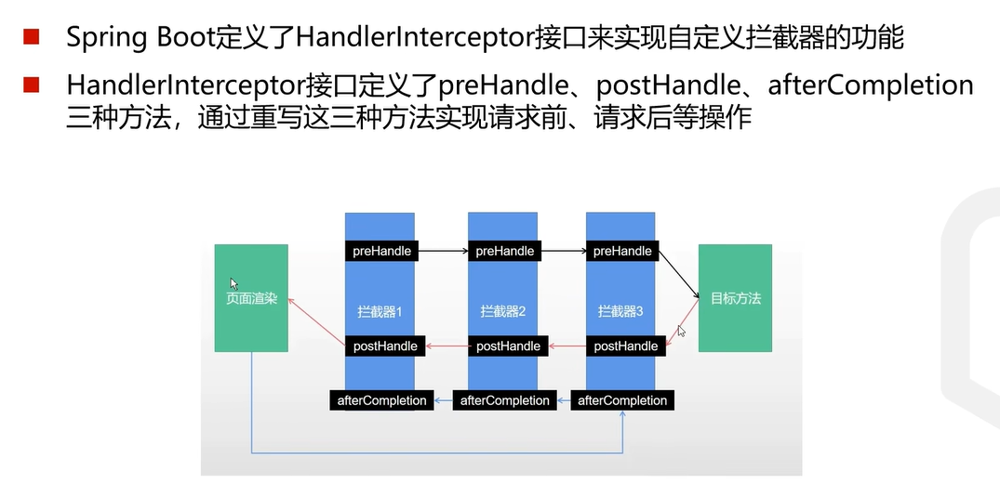

## 关于maven
### 所需要的依赖首先会在本地仓库寻找，没有的话会到远程仓库下载到本地仓库

---

### 默认仓库位置是在C:\Users\用户\.m2
### 也可以手动配置本地仓库的位置
* 找到maven安装包下的conf/settins.xml文件
* 添加下面的标签即可

* 如果下载速度慢的话可以添加镜像，如下所示

* 最后在settings找到maven，使之生效

