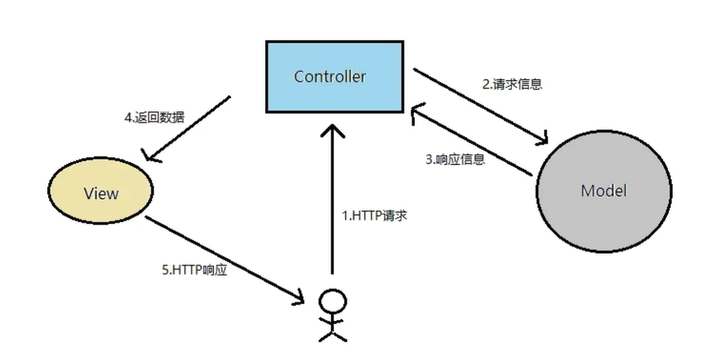
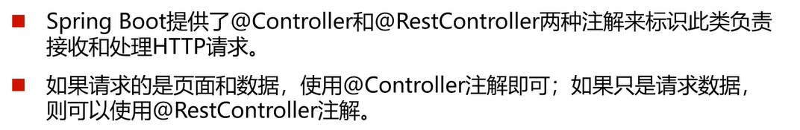
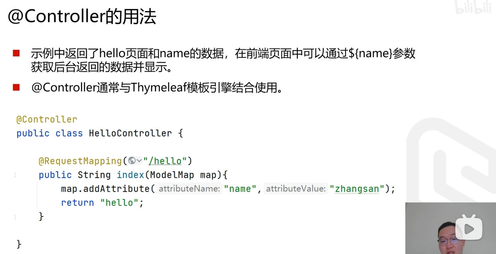
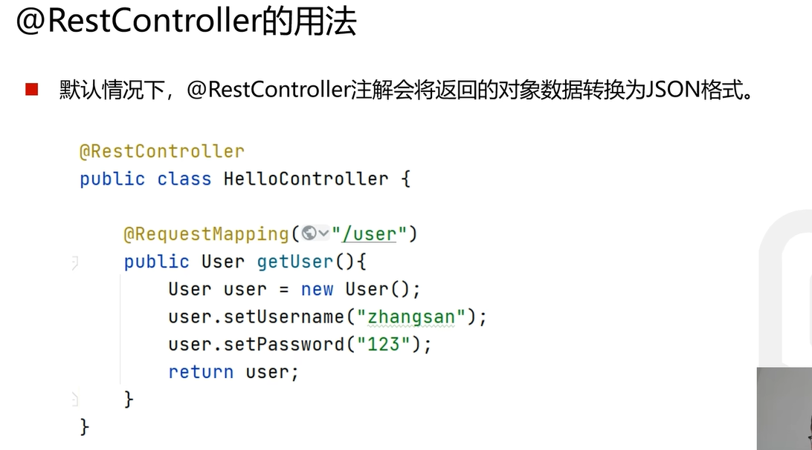
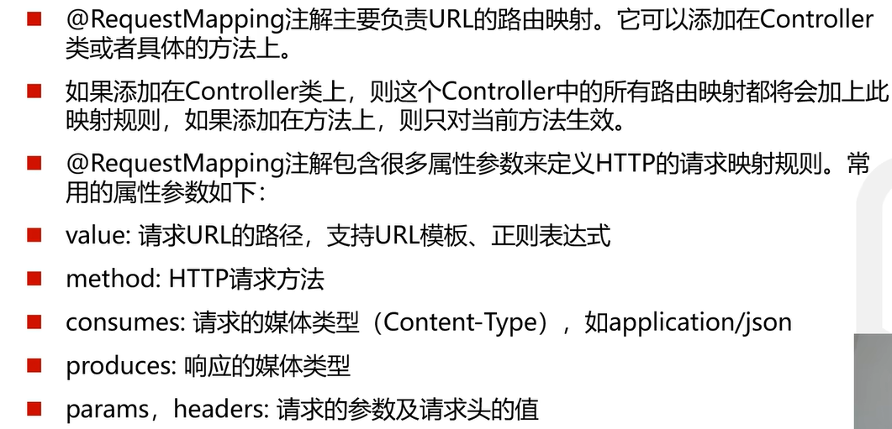
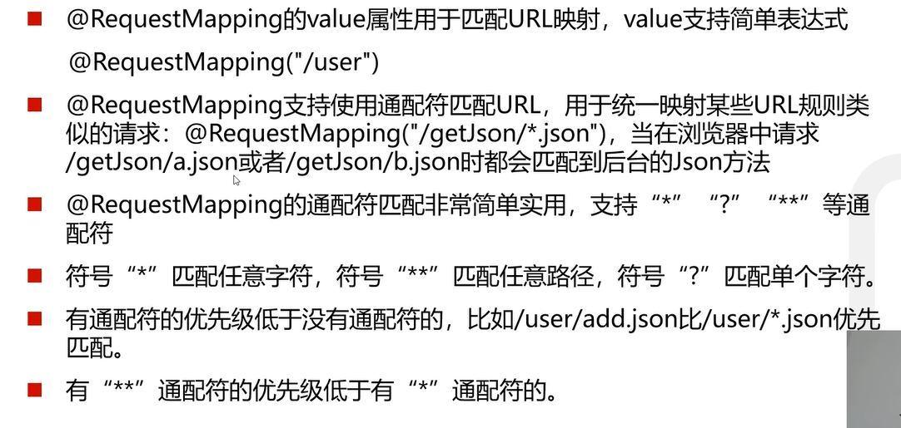
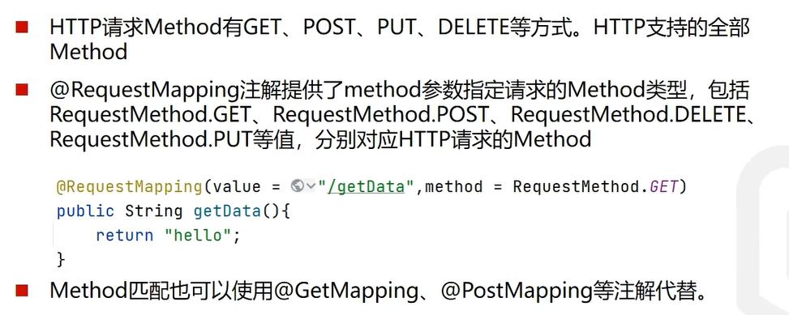
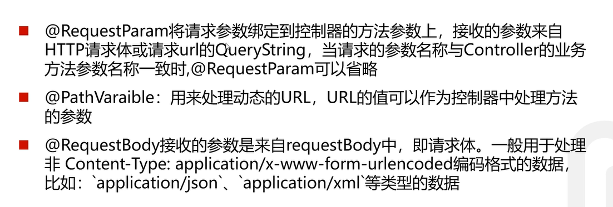
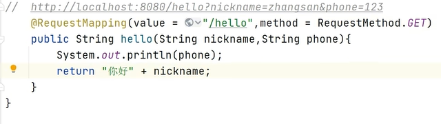
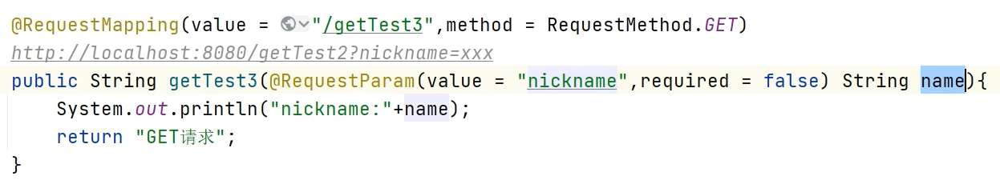

## 1. MVC框架
* model用来存储数据/封装数据
* controller用来协调和控制
* view用来显示数据

### 从数据库加载数据-->封装到model-->通过controller显示到-->view

## 2. 控制器的类型

### @Controller
* 只有要返回页面才使用@Controller,如下所示，返回的为"hello",会自动寻找hello.html页面
并且通常会配合Thymeleaf使用，这样前后端就不分离了，现在更多的项目采用的是前后端分离的模式

### @RestController

## 3. 路由映射
* 通常使用的属性只有value和method

### Method匹配

## 4. 参数传递
* 前端传送过来参数后端需要去接收，后续去进行处理

### 不用@RequestParam
* 接收的参数要匹配，如果用户没有传入所需的参数也不会报错，默认为null

### 使用@RequestParam
* 当传过来的参数和使用的参数不一致时可以使用，如nickname和name
* 默认required为true，也就是如果没有传过来参数会报错

