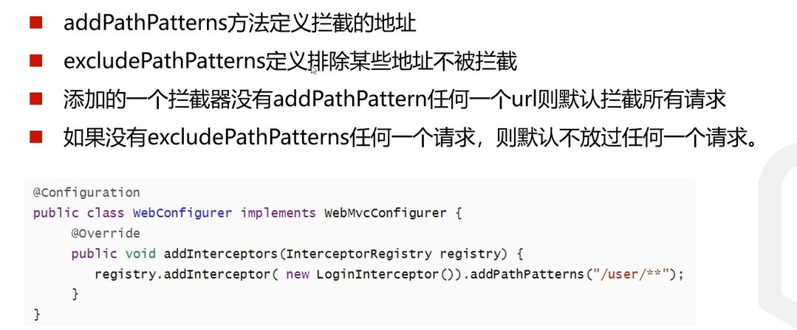

## 静态资源的访问
* 一般做前后端分离的项目的话，不会将静态资源文件放在static目录 
* 一般采用第一种方式就行了，不需要使用static-locations

1. 当把图片等静态资源放在static目录后，如果要访问该资源的话，直接输入
  http://ip:port/pic/name.jpg就可以了，不需要任何路径

2. 如果不想通过该根目录直接访问资源的话，可以设置，例如
static-path-pattern=/images/**
这时候如果访问，就需要加上images地址

## 文件的上传

---
___
* 当前端床来的表单的enctype属性不同时，有不同的传输格式
* 这里用postman来发送表单，并设置enctype属性
* 想要发送文本或者文件的话就要设置enctype为form-data

### spring boot 实现文件上传
* 结合代码看(FileUploadController)

## 拦截器

* 用的最多的是preHandle方法
* 结合代码(LoginInterceptor)

## 拦截器的注册
* 结合代码(WebConfig)

